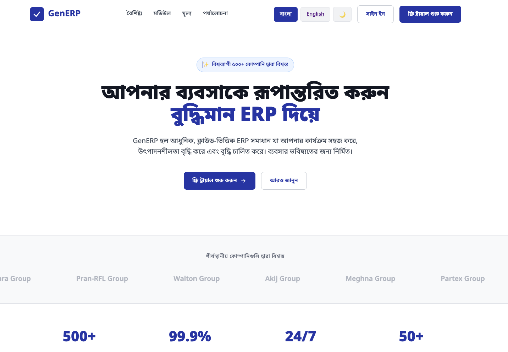
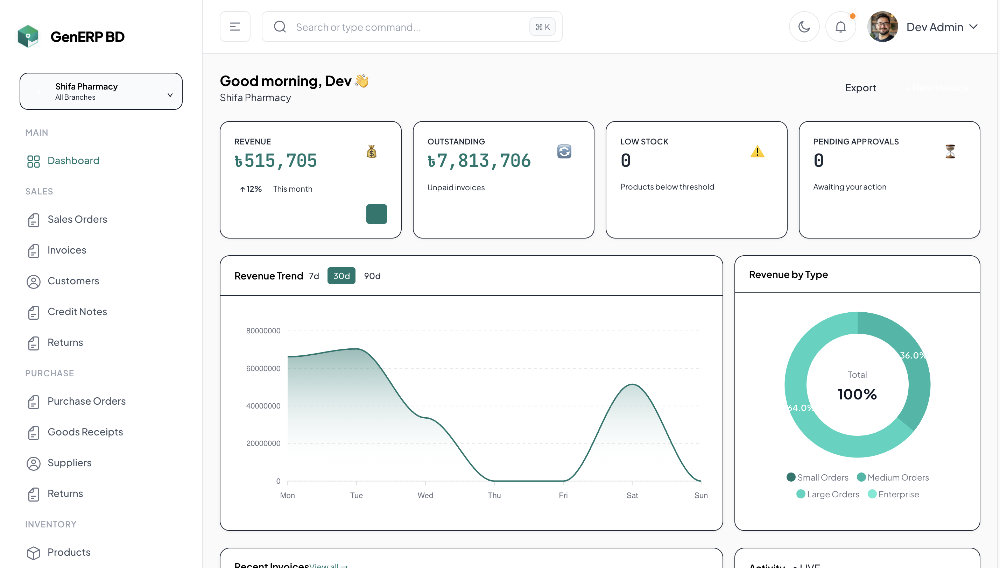

<h1 align="center">GenERP BD</h1>
<p align="center">
  <strong>A Generalised Cloud ERP / SaaS Platform for Bangladesh 🇧🇩</strong>
</p>
<p align="center">
  
  
  
  
  
  
  
</p>


## 🎯 Project Vision

**GenERP BD** aims to eliminate the need for custom ERP software for SMEs in Bangladesh. By providing a core engine with infinite configuration options, it adapts to the business rather than forcing the business to adapt to it. It operates on a **Freemium SaaS** model with a "Bangla-first" approach.

With **GenERP BD**, businesses get enterprise-grade features with completely dynamic configuration, eliminating the need for expensive custom development per industry. From a sole freelancer to a 1,000-employee RMG factory, this application scales and configures to map their operations inherently.
<p align="center">
  
</p>
<p align="center">
  
</p>

## ✨ Core Platform Capabilities

- **🏢 True Multi-Tenancy:** One login manages unlimited companies and branches. Architectural data isolation is enforced via a global Eloquent scope (`company_id`). A bug in application code cannot expose cross-company data.
- **🏷️ Entity Aliasing:** Dynamically rename core entities to match distinct business vocabularies (e.g., Customer → Patient, Student, Client, or Donor) with dynamic configuration UI.
- **⚙️ Dynamic Custom Fields:** Add virtually any field (Text, Dropdown, Date, Multi-select, Formula, File) to any entity directly from the application UI, natively indexed.
- **🔄 Configurable Workflows:** Define custom approval chains, transition statuses, SLA timers, and role-based automation per document type with auto-actions (notifications, field updates).
- **🇧🇩 Absolute Bangladesh Compliance Built-In:**
  - **Tax Engine:** VAT, SD, AIT calculation with compound tax support.
  - **Mushak Forms:** Automated generation of VAT forms (6.1, 6.2, 6.3, 6.6, 9.1).
  - **NBR Compliance:** Invoice formats and direct BD income tax slab auto-calculation.
  - **TDS/VDS:** Automatic tax deductions at source scaling to BD local laws.
  - **Labour Law:** Wage board compliance for RMG integrations.
- **📊 Report Builder:** Dynamic query execution with filters, grouping, sorting, and CSV export for custom business reports.
- **🔌 Plugin SDK:** Install/enable/disable/uninstall plugin lifecycle with marketplace-ready architecture.
- **🔔 Real-time Notifications:** Multi-channel notifications (in-app, email, SMS-ready) via Laravel Reverb WebSockets.
- **💳 Manual Payment Verification:** Fully integrated with bKash, Nagad, Rocket, and physical Bank Cheques/NPSB. No restrictive payment gateways. 
- **🌐 Bangla-First Bilingual UI:** Full Bengali language default handling, standard Noto Sans Bengali font throughout, Bengali numeral conversions, and English bilingual switches per user and company profiles.
- **🔐 Security & Compliance:**
  - **Two-Factor Authentication:** TOTP-based 2FA with recovery codes.
  - **Security Headers:** CSP, HSTS, X-Frame, XSS protection middleware.
  - **Audit Logging:** Complete audit trail of all create/update/delete operations.
  - **Account Lockout:** Brute force protection with email notifications.
- **🧾 Configurable Number Sequencing:** Custom prefix, suffix, embeddable branch codes, and reset boundaries for document types (Invoices, Purchases, etc.).
- **🌐 REST API v1:** Production-ready API with 96 endpoints, Sanctum authentication, OpenAPI 3.0 spec, and rate limiting.

## 📦 Functional Modules

- **Products & Inventory:** Support for physical stock, multi-warehouse, batch/FEFO tracking, expiry alerts, or a stripped-down Service Catalogue mode without inventory dependencies.
- **Sales & Invoicing:** Complete cycle from quotation to final invoice, capturing custom tax lines, manual MFS verification, and POS sessions.
- **Purchasing & AP:** Supplier ledger, goods received notes, and purchase/expense approvals.
- **Core Accounting:** Real-time general ledger, Trial Balance, P&L, balance sheets, automated double-entry journal logs.
- **HR & Payroll:** Biometric integrations, leave regulations aligned with the Bangladesh Labour Act, and custom salary structure templates.

## 📊 Project Statistics

- **Models:** 108 Eloquent models with multi-tenant isolation
- **Services:** 66 business logic service classes
- **Filament Resources:** 159 admin panel resources
- **Database Migrations:** 108 migrations
- **Enums:** 37 type-safe enum classes
- **API Endpoints:** 96 REST endpoints across 39 controllers
- **Test Coverage:** 327+ tests with 847 assertions

## 🌐 REST API v1

**Production-ready API** with comprehensive coverage:
- **96 endpoints** across 11 modules
- **Laravel Sanctum** token-based authentication
- **Rate limiting:** 60 requests/minute per user
- **Standard JSON envelope:** `{success, data, message}`
- **OpenAPI 3.0** specification available at `public/openapi.json`

### API Modules

| Module | Endpoints | Key Features |
|--------|-----------|--------------|
| Core Business | 35 | Customers, Products, Invoices, Suppliers, Sales/Purchase Orders |
| Inventory | 5 | Stock movements, warehouse transfers |
| Financial | 17 | Payments, Expenses, Credit Notes, Accounts, Journal Entries |
| HR & Payroll | 17 | Attendance, Leave, Payslips, Payroll processing |
| Workflow | 8 | Approval workflows, state transitions |
| Documents | 11 | Upload, download, preview with thumbnails |
| Settings | 40 | Companies, Branches, Tax Groups, Custom Fields |
| User Mgmt | 11 | Users, Invitations, role assignments |

### API Authentication
```
Authorization: Bearer {token}
```

## 🛠️ Tech Stack

- **Backend:** Laravel 12 (PHP 8.2+)
- **Admin Panel:** FilamentPHP v4 (TALL Stack)
- **Frontend:** Vue 3 + TailAdmin + TailwindCSS 4.0 + Inertia.js
- **Database:** MySQL 8 (UTF8mb4_unicode_ci)
- **Memory & Queues:** Redis + Laravel Horizon
- **Real-time Engine:** Laravel Reverb + Echo (WebSockets)
- **Auth & RBAC:** Laravel Sanctum + Spatie Permission + stancl/tenancy
- **Testing:** Pest 3.0 + Laravel Dusk (327+ tests, 847 assertions)
- **PDF Generation:** DomPDF with embedded Noto Sans Bengali font
- **API Documentation:** OpenAPI 3.0 spec with 96 endpoints
- **Development Tools:** Laravel Pail, Laravel Pint, Laravel Sail

## 🚀 Getting Started

### Prerequisites

Ensure you have the following installed on your local development environment:
- PHP >= 8.2
- Composer
- MySQL >= 8.0
- Redis
- Node.js & NPM

### Installation

1. **Clone the repository:**
   ```bash
   git clone <repository_url>
   cd gen-erp
   ```

2. **Install PHP dependencies:**
   ```bash
   cd gen-erp-application
   composer install
   ```

3. **Install NPM dependencies:**
   ```bash
   npm install
   npm run build
   ```

4. **Environment Setup:**
   ```bash
   cp .env.example .env
   php artisan key:generate
   ```
   *Update the `.env` file with your database, Redis, Reverb, and mail credentials.*

5. **Run Migrations & Seeders:**
   ```bash
   php artisan migrate:fresh --seed
   ```

6. **Serve the Application:**
   ```bash
   php artisan serve
   ```
   *You can also start Horizon and Reverb in separate terminals:*
   ```bash
   php artisan horizon
   php artisan reverb:start
   ```

## 🧪 Development & Testing

### Dev Admin Credentials
After running `php artisan migrate:fresh --seed`, use these credentials for development:

| Field | Value |
|-------|-------|
| Email | `dev@generp.test` |
| Password | `DevAdmin@123` |

### Sample Data Scenarios
Generate comprehensive test data using:
```bash
php artisan dev:seed-sample-data
```

This creates **3 realistic Bangladesh business scenarios**:

| Scenario | Records Generated |
|----------|-------------------|
| **Ruposhi Retail** (Retail Shop) | 50 users, 200 products, 100 customers, 50 sales orders, 100 invoices, 500 stock movements |
| **Shifa Pharmacy** (Healthcare) | 10 users, 100 medicines, 50 customers, 30 sales orders, 60 invoices, 200 stock movements |
| **Apex Garments** (Manufacturing/Export) | 15 users, 150 products, 30 customers, 25 sales orders, 40 invoices, 150 stock movements |

All scenarios include complete HR data (departments, designations, employees), warehouses, branches, suppliers, expenses, and documents.

### Running Tests
```bash
php artisan test
```

**Test Results:** 327 passed, 35 pre-existing failures, 3 skipped, 847 assertions

## 🔒 Enterprise Security Architecture

Security is baked into the foundation, ensuring robust enterprise-grade protection:
- **Strict Tenant Isolation:** Cross-tenant vulnerabilities are nullified. The `company_id` Eloquent scope operates uniformly across all system levels.
- **SQL Injection Defenses:** Application runs strictly on Laravel Query Builder and standard Eloquent APIs. Raw SQL (`DB::statement`) is unconditionally prohibited.
- **XSS & CSRF Guardrails:** Full escape on user data in Blade and Alpine.js, enforced `VerifyCsrfToken` middleware on all mutations. Complete whitelist MIME validation.
- **Brute Force Resiliency:** Login paths configured natively using caching throttle blocks integrated closely via Cloudflare CDN network layers.
- **Restricted Uploader Context:** Stored items leverage obfuscated UUID generation isolated inside private system scopes (no public web access).

## 📄 License & Ownership

Proprietary Software. All rights reserved by **GenERP BD**.
