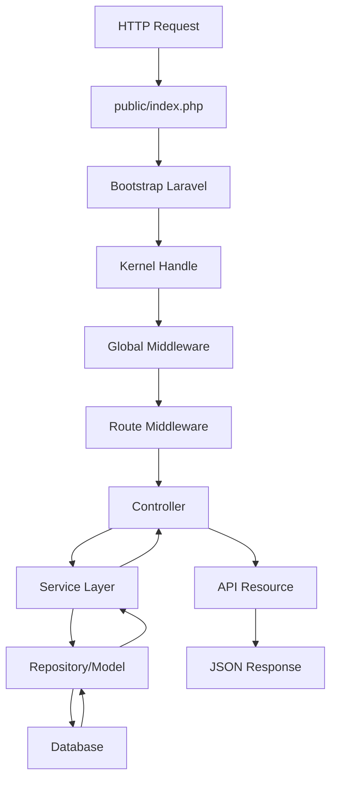
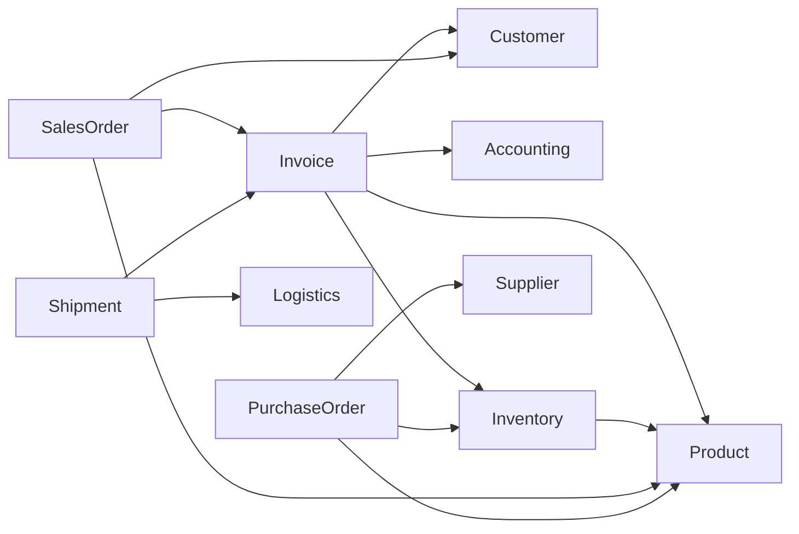
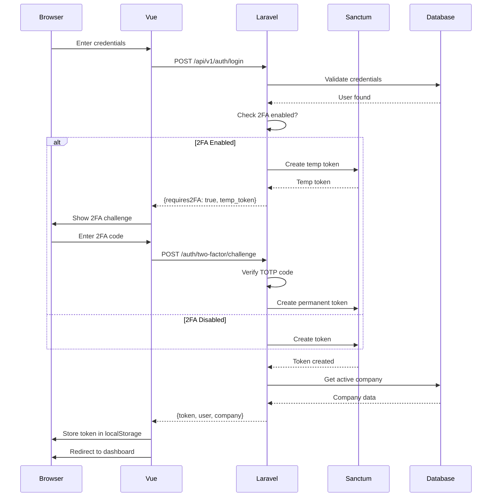
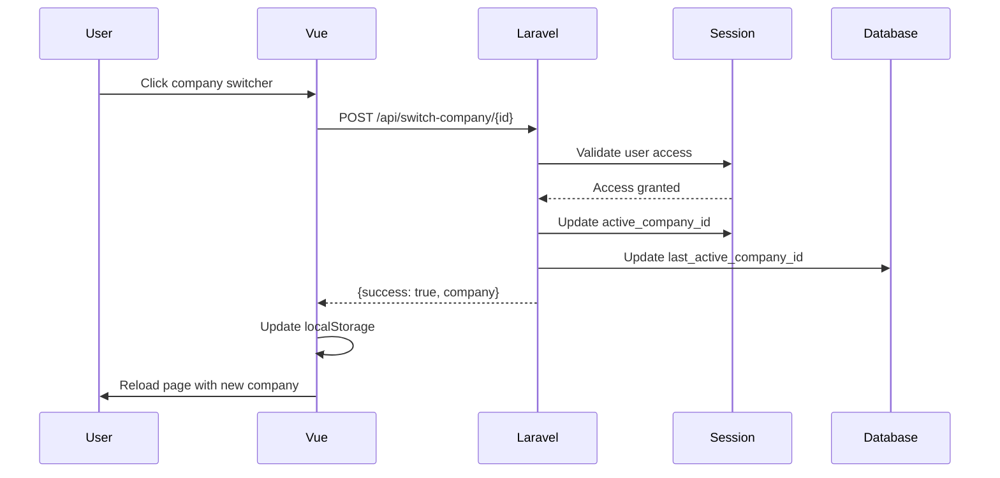
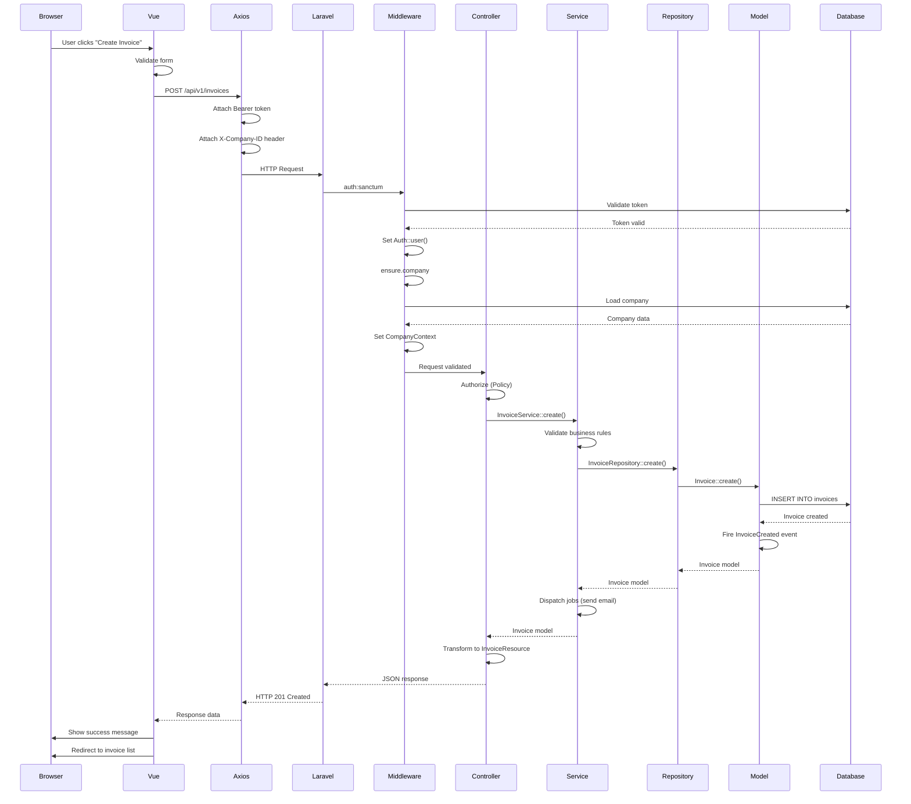

# Application Flow

## Table of Contents
- [Overview](#overview)
- [Backend Flow](#backend-flow)
- [Frontend Flow](#frontend-flow)
- [Authentication Flow](#authentication-flow)
- [Full Request Lifecycle](#full-request-lifecycle)

---

## Overview

This document traces the complete request lifecycle through Gen-ERP, from browser to database and back. Understanding these flows is critical for debugging, optimization, and feature development.

---

## Backend Flow

### How an API Request Enters Laravel



### Full Middleware Stack

Middleware executes in this order for authenticated API requests:

#### 1. Global Middleware (Always Runs)
```php
// bootstrap/app.php
- TrustProxies
- HandleCors
- PreventRequestsDuringMaintenance
- ValidatePostSize
- TrimStrings
- ConvertEmptyStringsToNull
```

#### 2. API Middleware Group
```php
// routes/api.php: Route::middleware(['auth:sanctum', 'throttle:api'])
```

**auth:sanctum** — Laravel Sanctum Authentication
- Checks for Bearer token in Authorization header
- Validates token from `personal_access_tokens` table
- Sets authenticated user via `Auth::user()`
- Returns 401 if token invalid/missing

**throttle:api** — Rate Limiting
- Limits: 60 requests per minute per user
- Returns 429 Too Many Requests if exceeded

#### 3. Business Route Middleware
```php
// routes/api.php: Route::middleware(['ensure.company'])
```

**ensure.company** — Company Context Resolution
- File: `app/Http/Middleware/EnsureActiveCompany.php`
- Resolves company ID from:
  - API: `X-Company-ID` header
  - Web: Session `active_company_id`
- Validates user has access to company
- Sets active company in `CompanyContext` service
- Redirects to company setup if user has no companies
- Returns 403 if company not found or access denied

**ensure.branch** — Branch Context (Optional)
- File: `app/Http/Middleware/EnsureActiveBranch.php`
- Resolves branch from session or header
- Validates branch belongs to active company

**set.locale** — Language Setting
- File: `app/Http/Middleware/SetLocale.php`
- Sets app locale from user preference or header
- Supports: English (en), Bengali (bn)

**security.headers** — Security Headers
- File: `app/Http/Middleware/SecurityHeaders.php`
- Adds: X-Frame-Options, X-Content-Type-Options, etc.

**check.subscription** — Subscription Validation
- File: `app/Http/Middleware/CheckSubscriptionStatus.php`
- Validates company subscription is active
- Returns 402 Payment Required if expired

**enforce.module.access** — Feature Flags
- File: `app/Http/Middleware/EnforceModuleAccess.php`
- Checks if company plan includes requested module
- Returns 403 if module not available in plan

### Tenant Context Resolution

```php
// app/Http/Middleware/EnsureActiveCompany.php

public function handle(Request $request, Closure $next): Response
{
    $user = $request->user();
    
    // Resolve company ID
    $companyId = $this->resolveCompanyId($request);
    
    // User has no companies → redirect to setup
    if (!$companyId && $user->companies()->count() === 0) {
        return redirect()->route('company.setup');
    }
    
    // Load company and validate access
    $company = Company::find($companyId);
    
    if (!$company || !$user->companies()->where('companies.id', $companyId)->exists()) {
        return response()->json(['message' => 'Invalid company'], 403);
    }
    
    // Set active company in context
    CompanyContext::setActive($company);
    
    return $next($request);
}

private function resolveCompanyId(Request $request): ?int
{
    // API: X-Company-ID header
    if ($request->expectsJson()) {
        return $request->header('X-Company-ID');
    }
    
    // Web: Session
    return session('active_company_id') ?? $request->user()->last_active_company_id;
}
```

### Authentication Flow (Sanctum)

#### Login Process
```php
// POST /api/v1/auth/login
{
    "email": "user@example.com",
    "password": "password"
}
```

**Flow:**
1. `AuthController@login` validates credentials
2. Check if 2FA enabled:
   - If yes: Return temp token + `requires2FA: true`
   - If no: Continue to step 3
3. Create Sanctum token: `$user->createToken('api-token')`
4. Return token + active company
5. Frontend stores token in localStorage
6. Frontend attaches token to all API requests

**Response:**
```json
{
    "success": true,
    "data": {
        "token": "1|abc123...",
        "user": { "id": 1, "name": "John Doe", "email": "user@example.com" },
        "active_company": { "id": 1, "name": "Demo Company" },
        "two_factor_required": false
    },
    "message": "Login successful"
}
```

#### 2FA Challenge (If Enabled)
```php
// POST /api/v1/auth/two-factor/challenge
{
    "code": "123456"
}
```

**Flow:**
1. Validate temp token from login
2. Verify TOTP code using Google2FA
3. If valid: Create permanent token
4. Return permanent token + company

#### Token Validation (Every Request)
```php
// Authorization: Bearer 1|abc123...
```

**Flow:**
1. Sanctum middleware extracts token from header
2. Query `personal_access_tokens` table
3. Validate token not expired
4. Load associated user
5. Set `Auth::user()` for request

### Authorization Flow (Policies)

```php
// Example: InvoicePolicy

public function view(User $user, Invoice $invoice): bool
{
    // Check company access
    return $invoice->company_id === CompanyContext::getActiveId();
}

public function update(User $user, Invoice $invoice): bool
{
    // Check company + role
    return $invoice->company_id === CompanyContext::getActiveId()
        && $user->hasRole(['admin', 'accountant']);
}
```

**Usage in Controller:**
```php
public function update(UpdateInvoiceRequest $request, Invoice $invoice)
{
    $this->authorize('update', $invoice); // Calls InvoicePolicy@update
    
    // Business logic...
}
```

### Key Business Rules Enforced in Code

#### 1. Multi-Tenancy (Company Scoping)
```php
// app/Domain/Shared/Models/BaseModel.php

protected static function booted()
{
    // Auto-scope all queries to active company
    static::addGlobalScope('company', function (Builder $builder) {
        if (CompanyContext::hasActive()) {
            $builder->where('company_id', CompanyContext::getActiveId());
        }
    });
    
    // Auto-set company_id on create
    static::creating(function ($model) {
        if (!$model->company_id && CompanyContext::hasActive()) {
            $model->company_id = CompanyContext::getActiveId();
        }
    });
}
```

#### 2. Lock Date Validation (Accounting)
```php
// app/Domain/Accounting/Services/JournalEntryService.php

public function create(JournalEntryData $data): JournalEntry
{
    $company = CompanyContext::getActive();
    
    // Validate transaction date not before lock date
    if ($company->lock_date && $data->date < $company->lock_date) {
        throw new LockDateException(
            "Cannot create entry before lock date: {$company->lock_date->format('Y-m-d')}"
        );
    }
    
    // Create entry...
}
```

#### 3. Stock Validation (Inventory)
```php
// app/Domain/Inventory/Services/StockMovementService.php

public function createOutbound(StockMovementData $data): StockMovement
{
    $stockLevel = StockLevel::where('product_id', $data->productId)
        ->where('warehouse_id', $data->warehouseId)
        ->first();
    
    // Validate sufficient stock
    if (!$stockLevel || $stockLevel->quantity < $data->quantity) {
        throw new InsufficientStockException(
            "Insufficient stock. Available: {$stockLevel->quantity}, Required: {$data->quantity}"
        );
    }
    
    // Create movement...
}
```

### Cross-Module Dependencies



---

## Frontend Flow

### How Vue Router is Configured

```javascript
// resources/js/app.js

import { createInertiaApp } from '@inertiajs/vue3'
import { resolvePageComponent } from 'laravel-vite-plugin/inertia-helpers'

createInertiaApp({
  title: title => `${title} — GenERP BD`,
  resolve: name => resolvePageComponent(
    `./Pages/${name}.vue`, 
    import.meta.glob('./Pages/**/*.vue')
  ),
  setup({ el, App, props, plugin }) {
    // Sync company ID from server to sessionStorage
    const companyId = props.initialPage.props.auth?.company?.id
    if (companyId) {
      sessionStorage.setItem('active_company_id', companyId)
    }
    
    createApp({ render: () => h(ThemeProvider, {}, () => h(App, props)) })
      .use(plugin)
      .use(createPinia())
      .use(VueApexCharts)
      .mount(el)
  },
  progress: { color: '#14B8A6', showSpinner: false },
})
```

**Inertia.js Routing:**
- No client-side router (Vue Router not used)
- Server-side routing via Laravel routes
- Inertia handles page transitions without full reload
- Pages defined in `routes/web.php`

**Example Route:**
```php
// routes/web.php
Route::get('/crm/leads', fn () => Inertia::render('CRM/Leads/Index'))
    ->name('crm.leads.index');
```

Maps to: `resources/js/Pages/CRM/Leads/Index.vue`

### Authentication State Management

**No Pinia Store for Auth** — Auth state managed by Inertia shared props:

```php
// app/Http/Middleware/HandleInertiaRequests.php

public function share(Request $request): array
{
    return array_merge(parent::share($request), [
        'auth' => [
            'user' => $request->user() ? [
                'id' => $request->user()->id,
                'name' => $request->user()->name,
                'email' => $request->user()->email,
            ] : null,
            'company' => CompanyContext::hasActive() ? [
                'id' => CompanyContext::getActive()->id,
                'name' => CompanyContext::getActive()->name,
            ] : null,
        ],
        'flash' => [
            'success' => session('success'),
            'error' => session('error'),
        ],
    ]);
}
```

**Access in Vue:**
```vue
<script setup>
import { usePage } from '@inertiajs/vue3'

const page = usePage()
const user = computed(() => page.props.auth.user)
const company = computed(() => page.props.auth.company)
</script>
```

### Auth Guard (Route Protection)

**Server-Side Guard:**
```php
// routes/web.php
Route::middleware(['auth', 'verified', 'ensure.company'])->group(function () {
    Route::get('/dashboard', [DashboardController::class, 'index']);
    // Protected routes...
});
```

**No Client-Side Guard** — Inertia relies on server-side middleware. If user not authenticated, Laravel redirects to login.

### API Call Flow

#### Global HTTP Client Configuration

```javascript
// resources/js/bootstrap.js

import axios from 'axios'

// Configure axios for Sanctum SPA authentication
window.axios.defaults.withCredentials = true  // Send cookies
window.axios.defaults.headers.common['X-Requested-With'] = 'XMLHttpRequest'
window.axios.defaults.headers.common['Accept'] = 'application/json'

// CSRF token from meta tag
const token = document.head.querySelector('meta[name="csrf-token"]')
if (token) {
    window.axios.defaults.headers.common['X-CSRF-TOKEN'] = token.content
}

// Global error handling
window.axios.interceptors.response.use(
    response => response,
    async error => {
        if (error.response?.status === 401) {
            // Session expired
            window.location.href = '/login'
        }
        
        if (error.response?.status === 419) {
            // CSRF mismatch - refresh and retry
            await window.axios.get('/sanctum/csrf-cookie')
            return window.axios.request(error.config)
        }
        
        return Promise.reject(error)
    }
)
```

#### API Service Layer

```javascript
// resources/js/Services/api.js

import axios from 'axios'

const api = axios.create({
    baseURL: '/api/v1',
    headers: {
        'Accept': 'application/json',
        'Content-Type': 'application/json',
        'X-Requested-With': 'XMLHttpRequest'
    }
})

// Token management
export const tokenManager = {
    get: () => localStorage.getItem('auth_token'),
    set: (token) => localStorage.setItem('auth_token', token),
    remove: () => {
        localStorage.removeItem('auth_token')
        localStorage.removeItem('active_company')
    },
    getCompany: () => {
        const company = localStorage.getItem('active_company')
        return company ? JSON.parse(company) : null
    },
    setCompany: (company) => localStorage.setItem('active_company', JSON.stringify(company))
}

// Request interceptor
api.interceptors.request.use(config => {
    const token = tokenManager.get()
    if (token) {
        config.headers.Authorization = `Bearer ${token}`
    }
    
    const company = tokenManager.getCompany()
    if (company?.id) {
        config.headers['X-Company-ID'] = company.id
    }
    
    return config
})

// Response interceptor
api.interceptors.response.use(
    response => response,
    error => {
        if (error.response?.status === 401) {
            tokenManager.remove()
            window.location.href = '/login'
        }
        return Promise.reject(error)
    }
)

export default api
```

### How Auth Token is Attached

**For API Calls (SPA Mode):**
```javascript
// Stored in localStorage after login
localStorage.setItem('auth_token', '1|abc123...')

// Attached via interceptor
config.headers.Authorization = `Bearer ${token}`
```

**For Inertia Calls (SSR Mode):**
- Uses session-based auth (cookies)
- No Bearer token needed
- CSRF token in meta tag

### 401/403 Response Handling

**401 Unauthorized:**
```javascript
// Global interceptor redirects to login
if (error.response?.status === 401) {
    tokenManager.remove()
    window.location.href = '/login'
}
```

**403 Forbidden:**
```javascript
// Show error message, don't redirect
if (error.response?.status === 403) {
    // Display toast notification
    toast.error(error.response.data.message || 'Access denied')
}
```

### Loading and Error States

**Using useApi Composable:**
```javascript
// resources/js/Composables/useApi.js

export function useApi() {
    const loading = ref(false)
    const error = ref(null)
    
    const call = async (apiFunction, ...args) => {
        loading.value = true
        error.value = null
        
        try {
            const response = await apiFunction(...args)
            return response.data
        } catch (err) {
            error.value = err.response?.data?.message || 'An error occurred'
            throw err
        } finally {
            loading.value = false
        }
    }
    
    return { loading, error, call }
}
```

**Usage in Component:**
```vue
<script setup>
import { useApi } from '@/Composables/useApi'
import api from '@/Services/api'

const { loading, error, call } = useApi()

const fetchInvoices = async () => {
    const data = await call(api.get, '/invoices')
    invoices.value = data.data
}
</script>

<template>
    <div v-if="loading">Loading...</div>
    <div v-else-if="error">{{ error }}</div>
    <div v-else><!-- Data --></div>
</template>
```

---

## Authentication Flow

### Complete Login Flow



### Token Storage and Usage

**After Login:**
```javascript
// Store token
localStorage.setItem('auth_token', response.data.token)
localStorage.setItem('active_company', JSON.stringify(response.data.active_company))

// All subsequent API calls include token
axios.defaults.headers.common['Authorization'] = `Bearer ${response.data.token}`
```

### Company Switching



---

## Full Request Lifecycle

### Complete CRUD Request Flow



### Example: Create Invoice Request

**1. Frontend (Vue Component):**
```vue
<script setup>
import api from '@/Services/api'

const createInvoice = async () => {
    try {
        const response = await api.post('/invoices', {
            customer_id: form.customer_id,
            date: form.date,
            due_date: form.due_date,
            items: form.items
        })
        
        toast.success('Invoice created successfully')
        router.visit('/sales/invoices')
    } catch (error) {
        toast.error(error.response.data.message)
    }
}
</script>
```

**2. API Request:**
```http
POST /api/v1/invoices HTTP/1.1
Host: localhost:8000
Authorization: Bearer 1|abc123...
X-Company-ID: 1
Content-Type: application/json

{
    "customer_id": 5,
    "date": "2026-03-04",
    "due_date": "2026-04-04",
    "items": [
        {"product_id": 10, "quantity": 2, "price": 100.00}
    ]
}
```

**3. Middleware Processing:**
```php
// auth:sanctum validates token
// ensure.company validates company access and sets context
```

**4. Controller:**
```php
// app/Http/Controllers/Api/V1/InvoiceController.php

public function store(StoreInvoiceRequest $request)
{
    $this->authorize('create', Invoice::class);
    
    $invoice = $this->invoiceService->create(
        InvoiceData::fromRequest($request)
    );
    
    return new InvoiceResource($invoice);
}
```

**5. Service:**
```php
// app/Domain/Invoice/Services/InvoiceService.php

public function create(InvoiceData $data): Invoice
{
    return DB::transaction(function () use ($data) {
        // Create invoice
        $invoice = Invoice::create([
            'company_id' => CompanyContext::getActiveId(),
            'customer_id' => $data->customerId,
            'date' => $data->date,
            'due_date' => $data->dueDate,
            'status' => InvoiceStatus::Draft,
        ]);
        
        // Create invoice items
        foreach ($data->items as $item) {
            $invoice->items()->create($item);
        }
        
        // Fire event
        event(new InvoiceCreated($invoice));
        
        return $invoice;
    });
}
```

**6. Event Listener:**
```php
// app/Domain/Invoice/Listeners/CreateJournalEntry.php

public function handle(InvoiceCreated $event)
{
    // Create accounting journal entry
    $this->accountingService->createInvoiceEntry($event->invoice);
}
```

**7. Response:**
```json
{
    "success": true,
    "data": {
        "id": 123,
        "invoice_number": "INV-2026-0123",
        "customer": {
            "id": 5,
            "name": "ABC Company"
        },
        "date": "2026-03-04",
        "due_date": "2026-04-04",
        "total": 200.00,
        "status": "draft"
    },
    "message": "Invoice created successfully"
}
```

---

**Last Updated**: March 4, 2026
