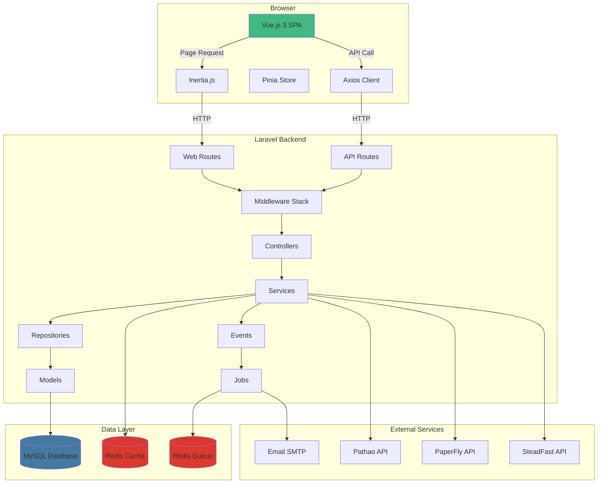
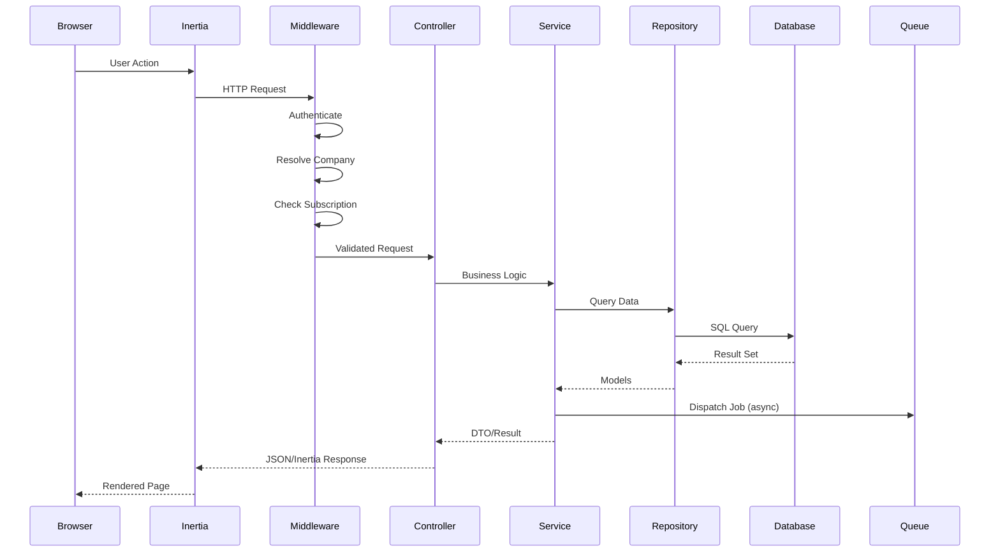

# System Architecture

## Table of Contents
- [Overview](#overview)
- [Backend Architecture](#backend-architecture)
- [Frontend Architecture](#frontend-architecture)
- [Full-Stack Architecture Diagram](#full-stack-architecture-diagram)

---

## Overview

Gen-ERP follows a **Domain-Driven Design (DDD)** architecture with strict separation of concerns. The backend is built on Laravel 12 with 30 business domains, while the frontend uses Vue.js 3 with Inertia.js for server-side rendering.

### Architectural Principles
- **Domain-Driven Design**: Business logic organized into 30 bounded contexts
- **CQRS Pattern**: Command/Query separation in Invoice domain
- **Event-Driven**: Domain events trigger side effects and notifications
- **Multi-Tenancy**: Company-based data isolation with automatic scoping
- **API-First**: RESTful API with OpenAPI documentation
- **Type Safety**: DTOs for data transfer, Enums for business rules

---

## Backend Architecture

### Directory Structure
```
app/
├── Domain/                          # 30 Business Domains (DDD)
│   ├── Accounting/
│   │   ├── Models/                  # Account, AccountGroup, JournalEntry
│   │   ├── Services/                # AccountingService, JournalEntryService
│   │   ├── Actions/                 # CreateJournalEntryAction
│   │   ├── DTOs/                    # JournalEntryData, AccountData
│   │   ├── Contracts/               # Service interfaces
│   │   ├── Repositories/            # Data access layer
│   │   ├── Events/                  # JournalEntryCreated
│   │   ├── Listeners/               # UpdateAccountBalances
│   │   ├── Policies/                # JournalEntryPolicy
│   │   └── Exceptions/              # Domain-specific exceptions
│   ├── Auth/
│   │   ├── Models/                  # User, Company, CompanyUser
│   │   ├── Services/                # AuthService, CompanyService
│   │   ├── Actions/                 # LoginAction, RegisterAction
│   │   └── [standard domain structure]
│   ├── CRM/
│   │   ├── Models/                  # Lead, Opportunity, Pipeline
│   │   ├── Services/                # LeadService, OpportunityService
│   │   ├── Enums/                   # LeadStatus, OpportunityStage
│   │   └── [standard domain structure]
│   ├── Customer/                    # Customer management
│   ├── Document/                    # Document storage
│   ├── HR/                          # Human resources
│   ├── Inventory/                   # Stock management
│   ├── Invoice/                     # Invoicing (CQRS pattern)
│   │   ├── Commands/                # CreateInvoiceCommand
│   │   ├── Queries/                 # GetInvoicesQuery
│   │   ├── Handlers/                # Command/Query handlers
│   │   ├── EventSourcing/           # Event store
│   │   └── [standard domain structure]
│   ├── Logistics/                   # Shipment tracking
│   │   ├── Integrations/            # Pathao, PaperFly, SteadFast APIs
│   │   └── [standard domain structure]
│   ├── Notification/                # Notification system
│   ├── Payment/                     # Payment processing
│   ├── POS/                         # Point of sale
│   ├── Product/                     # Product catalog
│   ├── Project/                     # Project management
│   ├── Purchase/                    # Purchase orders
│   ├── Report/                      # Reporting engine
│   ├── Sales/                       # Sales management
│   ├── SalesOrder/                  # Sales orders
│   ├── Shared/                      # Shared domain logic
│   │   ├── Models/                  # BaseModel, TenantScoped
│   │   ├── Services/                # Shared services
│   │   ├── Traits/                  # BelongsToCompany, Auditable
│   │   ├── EventSourcing/           # Event store infrastructure
│   │   └── Authorization/           # Authorization helpers
│   ├── Subscription/                # Subscription management
│   ├── System/                      # System configuration
│   ├── Workflow/                    # Workflow engine
│   └── [10 more domains]
├── Http/
│   ├── Controllers/
│   │   ├── Api/V1/                  # API controllers (63+ controllers)
│   │   │   ├── AuthController.php
│   │   │   ├── CustomerController.php
│   │   │   ├── InvoiceController.php
│   │   │   └── [60+ more controllers]
│   │   ├── Auth/                    # Web auth controllers
│   │   └── [other controllers]
│   ├── Middleware/
│   │   ├── EnsureActiveCompany.php  # Company context validation
│   │   ├── EnsureActiveBranch.php   # Branch scoping
│   │   ├── SetLocale.php            # Language switching
│   │   ├── SecurityHeaders.php      # Security headers
│   │   ├── CheckSubscriptionStatus.php
│   │   └── EnforceModuleAccess.php
│   ├── Requests/                    # Form request validation
│   │   ├── Api/V1/                  # API request validation
│   │   ├── Customer/
│   │   ├── Invoice/
│   │   └── [domain-specific requests]
│   └── Resources/                   # API resources (JSON transformation)
│       ├── CustomerResource.php
│       ├── InvoiceResource.php
│       └── [50+ resources]
├── Services/                        # Cross-domain services
│   ├── CompanyContext.php           # Active company resolution
│   ├── BranchContext.php            # Active branch resolution
│   ├── TaxCalculationService.php    # Tax calculations
│   ├── NotificationService.php      # Notification dispatch
│   ├── ImportService.php            # Data import
│   └── Dashboard/                   # Dashboard widgets
├── Jobs/                            # Background jobs
│   ├── ProcessImportJob.php
│   ├── SendNotificationJob.php
│   ├── RecordAuditLog.php
│   └── [10+ jobs]
├── Events/                          # Application events
│   ├── ModelSaved.php
│   ├── LowStockAlert.php
│   └── [domain events]
├── Listeners/                       # Event listeners
│   ├── CreateCreditNoteReversal.php
│   └── EvaluateAlertRules.php
├── Observers/                       # Model observers
│   ├── CustomFieldDefinitionObserver.php
│   └── EntityAliasObserver.php
├── Providers/                       # Service providers
│   ├── AppServiceProvider.php       # Registers all services
│   ├── AuthServiceProvider.php      # Authorization policies
│   ├── EventServiceProvider.php     # Event discovery
│   ├── CRMServiceProvider.php       # CRM domain bindings
│   └── CqrsServiceProvider.php      # CQRS handlers
└── Support/
    ├── Enums/                       # Business rule enums (40+ enums)
    │   ├── InvoiceStatus.php
    │   ├── LeadStatus.php
    │   ├── ShipmentStatus.php
    │   └── [37+ more enums]
    ├── Traits/                      # Reusable traits
    └── Helpers/                     # Helper functions
```

### Architectural Layers

#### 1. Domain Layer (Business Logic)
Each domain follows this structure:

**Models**: Eloquent models with relationships
- Extend `BaseModel` from Shared domain
- Use `BelongsToCompany` trait for automatic tenant scoping
- Define relationships, scopes, accessors, mutators
- Example: `Invoice`, `Customer`, `Lead`

**Services**: Business logic orchestration
- Implement service interfaces from Contracts
- Coordinate between repositories, actions, and events
- Handle transactions and error handling
- Example: `InvoiceService`, `LeadService`, `ShipmentService`

**Actions**: Single-responsibility operations
- Execute specific business operations
- Called by services or controllers
- Example: `CreateInvoiceAction`, `QualifyLeadAction`

**DTOs (Data Transfer Objects)**: Type-safe data containers
- Readonly classes for data transfer
- Validation and transformation
- Example: `InvoiceData`, `LeadData`, `ShipmentData`

**Repositories**: Data access abstraction
- Query optimization and caching
- Complex query logic
- Example: `CustomerRepository`, `InvoiceRepository`

**Events**: Domain events
- Triggered by business operations
- Decoupled side effects
- Example: `InvoiceCreated`, `LeadQualified`, `ShipmentDispatched`

**Listeners**: Event handlers
- React to domain events
- Trigger notifications, update related data
- Example: `SendInvoiceNotification`, `UpdateLeadScore`

**Policies**: Authorization rules
- Company-scoped access control
- Role-based permissions
- Example: `InvoicePolicy`, `LeadPolicy`

**Enums**: Business rules
- Status values, types, categories
- Type-safe constants
- Example: `InvoiceStatus`, `LeadStatus`, `ShipmentStatus`

#### 2. Application Layer (HTTP)
**Controllers**: HTTP request handling
- Thin controllers, delegate to services
- Return API resources or Inertia responses
- Example: `InvoiceController`, `CustomerController`

**Middleware**: Request/response processing
- Authentication, authorization, tenant scoping
- Security headers, locale setting
- Example: `EnsureActiveCompany`, `SetLocale`

**Requests**: Input validation
- Form request validation rules
- Authorization checks
- Example: `StoreInvoiceRequest`, `UpdateCustomerRequest`

**Resources**: JSON transformation
- Transform models to API responses
- Hide sensitive data, format dates
- Example: `InvoiceResource`, `CustomerResource`

#### 3. Infrastructure Layer
**Services**: Cross-cutting concerns
- `CompanyContext`: Resolves active company
- `TaxCalculationService`: Tax calculations
- `NotificationService`: Notification dispatch

**Jobs**: Asynchronous processing
- Queue-based background jobs
- Retry logic and failure handling
- Example: `ProcessImportJob`, `SendNotificationJob`

**Observers**: Model lifecycle hooks
- Automatic actions on model events
- Example: `CustomFieldDefinitionObserver`

### Key Laravel Packages

| Package | Version | Purpose |
|---------|---------|---------|
| laravel/framework | 12.0 | Core framework |
| laravel/sanctum | 4.3 | API authentication |
| laravel/reverb | 1.8 | WebSocket server |
| inertiajs/inertia-laravel | 2.0 | SSR integration |
| spatie/laravel-activitylog | 4.12 | Audit logging |
| spatie/laravel-permission | 6.0 | Role/permission management |
| darkaonline/l5-swagger | 2.1 | API documentation |
| barryvdh/laravel-dompdf | 3.1 | PDF generation |
| maatwebsite/excel | 3.1 | Excel import/export |
| brick/money | 0.11.1 | Money calculations |
| intervention/image | 3.0 | Image processing |

---

## Frontend Architecture

### Directory Structure
```
resources/js/
├── Pages/                           # Vue pages (40+ modules)
│   ├── Auth/
│   │   ├── Login.vue
│   │   ├── Register.vue
│   │   └── TwoFactorChallenge.vue
│   ├── Dashboard/
│   │   └── Index.vue                # Main dashboard
│   ├── CRM/
│   │   ├── Leads/
│   │   │   ├── Index.vue            # Lead list
│   │   │   ├── Create.vue           # Create lead
│   │   │   ├── Edit.vue             # Edit lead
│   │   │   └── Show.vue             # Lead details
│   │   ├── Opportunities/
│   │   ├── Pipelines/
│   │   └── Activities/
│   ├── Invoices/
│   │   ├── Index.vue
│   │   ├── Create.vue
│   │   ├── Edit.vue
│   │   └── Show.vue
│   ├── Customers/
│   ├── Products/
│   ├── Inventory/
│   ├── HR/
│   ├── Logistics/
│   ├── CMS/
│   ├── Reports/
│   ├── Settings/
│   └── [30+ more modules]
├── Components/                      # Reusable components
│   ├── Layout/
│   │   ├── AppLayout.vue            # Main layout wrapper
│   │   ├── Sidebar.vue              # Navigation sidebar
│   │   ├── Header.vue               # Top header
│   │   └── Footer.vue
│   ├── Forms/
│   │   ├── Input.vue
│   │   ├── Select.vue
│   │   ├── Textarea.vue
│   │   ├── DatePicker.vue
│   │   ├── FileUpload.vue
│   │   └── [20+ form components]
│   ├── Tables/
│   │   ├── DataTable.vue            # Sortable, filterable table
│   │   ├── Pagination.vue
│   │   └── TableActions.vue
│   ├── Charts/
│   │   ├── LineChart.vue
│   │   ├── BarChart.vue
│   │   ├── PieChart.vue
│   │   └── AreaChart.vue
│   ├── CMS/
│   │   ├── PageBuilder.vue          # Drag-drop page builder
│   │   ├── SectionRenderer.vue      # Renders 53+ section types
│   │   └── [CMS components]
│   ├── Notifications/
│   │   ├── Toast.vue                # Toast notifications
│   │   ├── BellDropdown.vue         # Notification bell
│   │   └── NotificationItem.vue
│   ├── UI/
│   │   ├── Button.vue
│   │   ├── Modal.vue
│   │   ├── Card.vue
│   │   ├── Badge.vue
│   │   ├── Alert.vue
│   │   └── [30+ UI components]
│   └── [domain-specific components]
├── Stores/                          # Pinia stores
│   └── pageBuilderStore.js          # CMS page builder state
├── Services/                        # API service layer
│   ├── api.js                       # Axios instance + interceptors
│   └── auth.js                      # Authentication service
├── Composables/                     # Vue 3 composables
│   ├── useApi.js                    # API call wrapper
│   ├── usePagination.js             # Pagination logic
│   ├── useSearch.js                 # Search functionality
│   └── useSidebar.ts                # Sidebar state
├── Utils/                           # Utility functions
│   └── pagination.js
├── Icons/                           # SVG icon components (50+ icons)
│   ├── HomeIcon.vue
│   ├── UserIcon.vue
│   └── [48+ more icons]
├── app.js                           # Vue app initialization
└── bootstrap.js                     # Axios + Echo setup
```

### Frontend Layers

#### 1. Pages Layer (Inertia.js)
- Server-rendered Vue components
- Receive props from Laravel controllers
- Handle page-level state and data fetching
- Example: `Pages/Invoices/Index.vue`

#### 2. Component Layer
**Layout Components**: App structure
- `AppLayout.vue`: Main wrapper with sidebar + header
- `Sidebar.vue`: Navigation with role-based menu
- `Header.vue`: User menu, notifications, company switcher

**Form Components**: Input handling
- Consistent styling with TailAdmin theme
- Validation error display
- Accessibility compliant

**Table Components**: Data display
- Sorting, filtering, pagination
- Bulk actions, row selection
- Export functionality

**UI Components**: Reusable elements
- Buttons, modals, cards, badges
- Consistent design system
- Dark mode support

#### 3. State Management (Pinia)
**pageBuilderStore**: CMS page builder state
- Section management
- Drag-drop state
- Undo/redo functionality

#### 4. Service Layer
**api.js**: Centralized API client
```javascript
// Axios instance with interceptors
- Base URL: /api/v1
- Auto-attach Bearer token
- Auto-attach X-Company-ID header
- Handle 401/419 errors (redirect to login)
- Handle 403 errors (show error message)
```

**auth.js**: Authentication service
```javascript
- login(credentials)
- logout()
- register(data)
- twoFactorChallenge(code)
- switchCompany(companyId)
```

#### 5. Composables Layer
**useApi**: API call wrapper
- Loading state management
- Error handling
- Success/error notifications

**usePagination**: Pagination logic
- Page state management
- URL query sync
- Per-page selection

**useSearch**: Search functionality
- Debounced search input
- Query parameter sync
- Clear search

**useSidebar**: Sidebar state
- Open/close state
- Mobile responsiveness
- Persist state to localStorage

### Component Hierarchy
```
AppLayout
├── Sidebar (navigation)
├── Header (user menu, notifications)
└── Main Content
    └── Page Component (from Inertia)
        ├── Page Header
        ├── Filters/Search
        ├── DataTable
        │   ├── Table Header (sortable)
        │   ├── Table Body
        │   │   └── Table Row
        │   │       └── Table Actions
        │   └── Pagination
        └── Modals (create/edit forms)
```

### TailAdmin Theme Integration
- **Base Theme**: TailAdmin Vue.js template
- **Customizations**:
  - Custom color scheme (teal primary)
  - Bengali font support (Noto Sans Bengali)
  - Custom sidebar navigation
  - Custom dashboard widgets
  - Custom form components
- **Preserved**: Layout structure, utility classes, responsive design

### Environment Variables Flow
```
.env → Laravel Config → Vite → Vue App
```

Example:
```env
VITE_APP_NAME="Gen-ERP"
```

Accessed in Vue:
```javascript
import.meta.env.VITE_APP_NAME
```

---

## Full-Stack Architecture Diagram



### Request Flow Diagram



---

**Last Updated**: March 4, 2026
