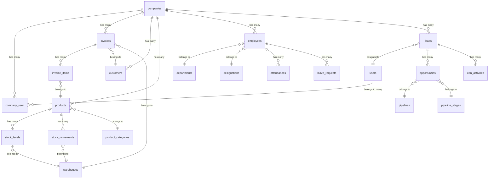

# Database Schema Documentation

## Table of Contents
- [Overview](#overview)
- [Database Engine](#database-engine)
- [Core Tables](#core-tables)
- [Financial Tables](#financial-tables)
- [Inventory Tables](#inventory-tables)
- [HR Tables](#hr-tables)
- [CRM Tables](#crm-tables)
- [Logistics Tables](#logistics-tables)
- [CMS Tables](#cms-tables)
- [System Tables](#system-tables)
- [Tenant Scoping Strategy](#tenant-scoping-strategy)
- [ER Diagram](#er-diagram)

---

## Overview

Gen-ERP uses a relational database with 150+ tables organized by business domain. All tables follow consistent naming conventions and include proper indexing for performance.

**Total Tables**: 150+
**Migration Files**: 150+
**Database Engine**: MySQL 8.0+ / SQLite (development)
**Character Set**: utf8mb4
**Collation**: utf8mb4_unicode_ci

---

## Database Engine

**Production**: MySQL 8.0+
**Development**: SQLite 3.x
**Features Used**:
- Foreign key constraints
- Generated columns (balance_due in invoices)
- JSON columns for flexible data
- Full-text indexes (planned)
- Soft deletes (deleted_at)

---

## Core Tables

### users
**Purpose**: User authentication and profile
**Tenant Scoped**: No (users can belong to multiple companies)

| Column | Type | Nullable | Description |
|--------|------|----------|-------------|
| id | bigint | No | Primary key |
| name | varchar(255) | No | Full name |
| email | varchar(255) | No | Email (unique) |
| email_verified_at | timestamp | Yes | Email verification |
| password | varchar(255) | No | Hashed password |
| two_factor_secret | text | Yes | 2FA secret (encrypted) |
| two_factor_recovery_codes | text | Yes | Recovery codes (encrypted) |
| two_factor_confirmed_at | timestamp | Yes | 2FA confirmation |
| last_active_company_id | bigint | Yes | FK to companies |
| preferred_language | varchar(10) | No | en/bn |
| remember_token | varchar(100) | Yes | Remember me token |
| created_at | timestamp | Yes | |
| updated_at | timestamp | Yes | |

**Indexes**:
- UNIQUE(email)
- INDEX(last_active_company_id)

**Relationships**:
- belongsToMany: companies (via company_user)

---

### companies
**Purpose**: Tenant companies
**Tenant Scoped**: No (root level)

| Column | Type | Nullable | Description |
|--------|------|----------|-------------|
| id | bigint | No | Primary key |
| uuid | uuid | No | UUID (unique) |
| name | varchar(255) | No | Company name |
| slug | varchar(255) | No | URL slug (unique) |
| logo_url | varchar(255) | Yes | Logo path |
| business_type | varchar(50) | No | Enum: retail, wholesale, manufacturing, service |
| country | varchar(2) | No | ISO country code |
| currency | varchar(3) | No | ISO currency code |
| timezone | varchar(50) | No | Timezone |
| locale | varchar(10) | No | Locale (en/bn) |
| vat_registered | boolean | No | VAT registration status |
| vat_bin | varchar(50) | Yes | VAT BIN number |
| lock_date | date | Yes | Accounting lock date |
| valuation_method | varchar(20) | No | FIFO/LIFO/Weighted Average |
| address_line1 | varchar(255) | Yes | Address |
| city | varchar(100) | Yes | City |
| postal_code | varchar(20) | Yes | Postal code |
| phone | varchar(50) | Yes | Phone |
| email | varchar(255) | Yes | Email |
| website | varchar(255) | Yes | Website |
| is_active | boolean | No | Active status |
| plan | varchar(50) | No | Subscription plan |
| plan_expires_at | timestamp | Yes | Plan expiry |
| settings | json | Yes | Company settings |
| onboarding_completed_at | timestamp | Yes | Onboarding completion |
| created_at | timestamp | Yes | |
| updated_at | timestamp | Yes | |
| deleted_at | timestamp | Yes | Soft delete |

**Indexes**:
- UNIQUE(uuid)
- UNIQUE(slug)
- INDEX(is_active)
- INDEX(plan)

---

### company_user
**Purpose**: User-company relationship with roles
**Tenant Scoped**: No (pivot table)

| Column | Type | Nullable | Description |
|--------|------|----------|-------------|
| id | bigint | No | Primary key |
| company_id | bigint | No | FK to companies |
| user_id | bigint | No | FK to users |
| role | varchar(50) | No | admin, manager, user, accountant, etc. |
| is_owner | boolean | No | Company owner flag |
| is_active | boolean | No | Active in company |
| joined_at | timestamp | Yes | Join date |
| created_at | timestamp | Yes | |
| updated_at | timestamp | Yes | |

**Indexes**:
- UNIQUE(company_id, user_id)
- INDEX(user_id)

---

## Financial Tables

### invoices
**Purpose**: Sales invoices
**Tenant Scoped**: Yes (company_id)

| Column | Type | Nullable | Description |
|--------|------|----------|-------------|
| id | bigint | No | Primary key |
| company_id | bigint | No | FK to companies |
| branch_id | bigint | Yes | FK to branches |
| sales_order_id | bigint | Yes | FK to sales_orders |
| customer_id | bigint | Yes | FK to customers |
| warehouse_id | bigint | No | FK to warehouses |
| invoice_number | varchar(100) | No | INV-YYYYMMDD-0001 |
| mushak_number | varchar(100) | Yes | VAT Mushak number (BD) |
| invoice_date | date | No | Invoice date |
| due_date | date | No | Payment due date |
| status | varchar(30) | No | draft, sent, paid, overdue, cancelled |
| subtotal | bigint | No | Amount in cents |
| discount_amount | bigint | No | Discount in cents |
| tax_amount | bigint | No | Tax in cents |
| shipping_amount | bigint | No | Shipping in cents |
| total_amount | bigint | No | Total in cents |
| amount_paid | bigint | No | Paid amount in cents |
| balance_due | bigint | No | Generated: total_amount - amount_paid |
| notes | text | Yes | Internal notes |
| terms_conditions | text | Yes | Terms & conditions |
| custom_fields | json | Yes | Custom fields |
| stock_deducted | boolean | No | Stock deduction flag |
| created_by | bigint | Yes | FK to users |
| created_at | timestamp | Yes | |
| updated_at | timestamp | Yes | |
| deleted_at | timestamp | Yes | Soft delete |

**Indexes**:
- INDEX(company_id, customer_id, invoice_date)
- INDEX(company_id, status, due_date)
- INDEX(invoice_number)

**Relationships**:
- belongsTo: company, branch, salesOrder, customer, warehouse, createdBy
- hasMany: items (invoice_items)

---

### invoice_items
**Purpose**: Invoice line items
**Tenant Scoped**: Via invoice

| Column | Type | Nullable | Description |
|--------|------|----------|-------------|
| id | bigint | No | Primary key |
| invoice_id | bigint | No | FK to invoices |
| product_id | bigint | Yes | FK to products |
| variant_id | bigint | Yes | FK to product_variants |
| description | text | No | Item description |
| quantity | decimal(15,4) | No | Quantity |
| unit_price | bigint | No | Price in cents |
| discount_amount | bigint | No | Discount in cents |
| tax_amount | bigint | No | Tax in cents |
| total_amount | bigint | No | Total in cents |
| created_at | timestamp | Yes | |
| updated_at | timestamp | Yes | |

**Indexes**:
- INDEX(invoice_id)
- INDEX(product_id)

---

### customers
**Purpose**: Customer master data
**Tenant Scoped**: Yes (company_id)

| Column | Type | Nullable | Description |
|--------|------|----------|-------------|
| id | bigint | No | Primary key |
| company_id | bigint | No | FK to companies |
| contact_group_id | bigint | Yes | FK to contact_groups |
| name | varchar(255) | No | Customer name |
| email | varchar(255) | Yes | Email |
| phone | varchar(50) | Yes | Phone |
| address | text | Yes | Address |
| city | varchar(100) | Yes | City |
| postal_code | varchar(20) | Yes | Postal code |
| country | varchar(2) | No | Country code |
| credit_limit | bigint | No | Credit limit in cents |
| payment_terms | integer | No | Payment terms (days) |
| tax_number | varchar(100) | Yes | Tax ID |
| is_active | boolean | No | Active status |
| custom_fields | json | Yes | Custom fields |
| created_at | timestamp | Yes | |
| updated_at | timestamp | Yes | |
| deleted_at | timestamp | Yes | Soft delete |

**Indexes**:
- INDEX(company_id, is_active)
- INDEX(email)
- INDEX(phone)

---

## Inventory Tables

### products
**Purpose**: Product catalog
**Tenant Scoped**: Yes (company_id)

| Column | Type | Nullable | Description |
|--------|------|----------|-------------|
| id | bigint | No | Primary key |
| company_id | bigint | No | FK to companies |
| category_id | bigint | Yes | FK to product_categories |
| name | varchar(255) | No | Product name |
| slug | varchar(255) | No | URL slug |
| sku | varchar(100) | No | Stock keeping unit |
| barcode | varchar(100) | Yes | Barcode |
| description | text | Yes | Description |
| product_type | varchar(20) | No | physical, service, digital |
| unit | varchar(20) | No | Unit of measure |
| cost_price | bigint | No | Cost in cents |
| selling_price | bigint | No | Selling price in cents |
| min_selling_price | bigint | Yes | Minimum price in cents |
| tax_group_id | bigint | Yes | FK to tax_groups |
| track_inventory | boolean | No | Track stock flag |
| valuation_method | varchar(20) | Yes | FIFO/LIFO/Weighted Average |
| low_stock_threshold | integer | Yes | Low stock alert threshold |
| has_variants | boolean | No | Has variants flag |
| is_active | boolean | No | Active status |
| image_url | varchar(255) | Yes | Product image |
| custom_fields | json | Yes | Custom fields |
| created_at | timestamp | Yes | |
| updated_at | timestamp | Yes | |
| deleted_at | timestamp | Yes | Soft delete |

**Indexes**:
- UNIQUE(company_id, sku)
- INDEX(company_id, is_active)
- INDEX(category_id)
- INDEX(barcode)

---

### stock_levels
**Purpose**: Current stock per warehouse
**Tenant Scoped**: Via product

| Column | Type | Nullable | Description |
|--------|------|----------|-------------|
| id | bigint | No | Primary key |
| product_id | bigint | No | FK to products |
| variant_id | bigint | Yes | FK to product_variants |
| warehouse_id | bigint | No | FK to warehouses |
| quantity | decimal(15,4) | No | Current quantity |
| reserved_quantity | decimal(15,4) | No | Reserved quantity |
| available_quantity | decimal(15,4) | No | Generated: quantity - reserved |
| created_at | timestamp | Yes | |
| updated_at | timestamp | Yes | |

**Indexes**:
- UNIQUE(product_id, variant_id, warehouse_id)
- INDEX(warehouse_id)

---

### stock_movements
**Purpose**: Stock transaction history
**Tenant Scoped**: Via product

| Column | Type | Nullable | Description |
|--------|------|----------|-------------|
| id | bigint | No | Primary key |
| product_id | bigint | No | FK to products |
| variant_id | bigint | Yes | FK to product_variants |
| warehouse_id | bigint | No | FK to warehouses |
| type | varchar(50) | No | purchase, sale, adjustment, transfer_in, transfer_out |
| quantity | decimal(15,4) | No | Quantity (positive/negative) |
| reference_type | varchar(255) | Yes | Polymorphic type |
| reference_id | bigint | Yes | Polymorphic ID |
| notes | text | Yes | Notes |
| created_at | timestamp | Yes | |

**Indexes**:
- INDEX(product_id, warehouse_id, created_at)
- INDEX(reference_type, reference_id)

---

## HR Tables

### employees
**Purpose**: Employee master data
**Tenant Scoped**: Yes (company_id)

| Column | Type | Nullable | Description |
|--------|------|----------|-------------|
| id | bigint | No | Primary key |
| company_id | bigint | No | FK to companies |
| user_id | bigint | Yes | FK to users |
| department_id | bigint | Yes | FK to departments |
| designation_id | bigint | Yes | FK to designations |
| employee_code | varchar(50) | No | EMP-0001 |
| first_name | varchar(100) | No | First name |
| last_name | varchar(100) | No | Last name |
| name_bangla | varchar(255) | Yes | Name in Bengali |
| email | varchar(255) | Yes | Email |
| phone | varchar(50) | Yes | Phone |
| date_of_birth | date | Yes | DOB |
| gender | varchar(20) | Yes | Gender |
| nid_number | text | Yes | National ID (encrypted) |
| tin_number | text | Yes | Tax ID (encrypted) |
| joining_date | date | No | Joining date |
| confirmation_date | date | Yes | Confirmation date |
| resignation_date | date | Yes | Resignation date |
| termination_date | date | Yes | Termination date |
| employment_type | varchar(20) | No | full_time, part_time, contract, intern |
| status | varchar(20) | No | active, on_leave, resigned, terminated |
| basic_salary | bigint | No | Salary in cents |
| gross_salary | bigint | No | Gross salary in cents |
| hourly_rate | decimal(10,2) | Yes | Hourly rate |
| weekly_capacity_hours | integer | Yes | Weekly capacity |
| is_available_for_projects | boolean | No | Project availability |
| skills | json | Yes | Skills array |
| certifications | json | Yes | Certifications array |
| bank_account_number | text | Yes | Bank account (encrypted) |
| address | text | Yes | Address |
| emergency_contact_name | varchar(255) | Yes | Emergency contact |
| emergency_contact_phone | varchar(50) | Yes | Emergency phone |
| photo_url | varchar(255) | Yes | Photo |
| show_on_website | boolean | No | Show on website |
| bio | text | Yes | Biography |
| position | varchar(255) | Yes | Position title |
| social_links | json | Yes | Social media links |
| custom_fields | json | Yes | Custom fields |
| created_at | timestamp | Yes | |
| updated_at | timestamp | Yes | |
| deleted_at | timestamp | Yes | Soft delete |

**Indexes**:
- UNIQUE(company_id, employee_code)
- INDEX(company_id, status)
- INDEX(department_id)
- INDEX(email)

---

## CRM Tables

### leads
**Purpose**: Lead management
**Tenant Scoped**: Yes (company_id)

| Column | Type | Nullable | Description |
|--------|------|----------|-------------|
| id | bigint | No | Primary key |
| uuid | uuid | No | UUID (unique) |
| company_id | bigint | No | FK to companies |
| assigned_to | bigint | Yes | FK to users |
| created_by | bigint | No | FK to users |
| first_name | varchar(255) | No | First name |
| last_name | varchar(255) | No | Last name |
| email | varchar(255) | Yes | Email |
| phone | varchar(50) | Yes | Phone |
| company_name | varchar(255) | Yes | Company |
| job_title | varchar(255) | Yes | Job title |
| address | text | Yes | Address |
| city | varchar(100) | Yes | City |
| state | varchar(100) | Yes | State |
| country | varchar(2) | No | Country code |
| postal_code | varchar(20) | Yes | Postal code |
| status | varchar(50) | No | new, contacted, qualified, unqualified, converted |
| source | varchar(50) | Yes | website, referral, social_media, etc. |
| score | integer | No | Lead score (0-100) |
| estimated_value | decimal(15,2) | Yes | Estimated value |
| currency | varchar(3) | No | Currency code |
| expected_close_date | date | Yes | Expected close date |
| last_contacted_at | timestamp | Yes | Last contact |
| qualified_at | timestamp | Yes | Qualification date |
| converted_at | timestamp | Yes | Conversion date |
| converted_to_customer_id | bigint | Yes | FK to customers |
| custom_fields | json | Yes | Custom fields |
| notes | text | Yes | Notes |
| created_at | timestamp | Yes | |
| updated_at | timestamp | Yes | |
| deleted_at | timestamp | Yes | Soft delete |

**Indexes**:
- UNIQUE(uuid)
- INDEX(company_id, status)
- INDEX(company_id, assigned_to)
- INDEX(company_id, source)
- INDEX(company_id, score)
- INDEX(email)
- INDEX(phone)

---

## Logistics Tables

### shipments
**Purpose**: Shipment tracking
**Tenant Scoped**: Yes (company_id)

| Column | Type | Nullable | Description |
|--------|------|----------|-------------|
| id | bigint | No | Primary key |
| company_id | bigint | No | FK to companies |
| carrier_id | bigint | No | FK to carriers |
| invoice_id | bigint | Yes | FK to invoices |
| customer_id | bigint | No | FK to customers |
| tracking_number | varchar(100) | No | Tracking number |
| sender_name | varchar(255) | No | Sender name |
| sender_phone | varchar(50) | No | Sender phone |
| sender_address | text | No | Sender address |
| recipient_name | varchar(255) | No | Recipient name |
| recipient_phone | varchar(50) | No | Recipient phone |
| recipient_address | text | No | Recipient address |
| weight | decimal(10,2) | Yes | Weight (kg) |
| declared_value | bigint | Yes | Value in cents |
| shipping_cost | bigint | No | Cost in cents |
| cod_amount | bigint | Yes | COD amount in cents |
| cod_charge | bigint | Yes | COD charge in cents |
| cod_collected_at | timestamp | Yes | COD collection date |
| cod_settled_at | timestamp | Yes | COD settlement date |
| status | varchar(50) | No | pending, dispatched, in_transit, delivered, etc. |
| notes | text | Yes | Notes |
| created_at | timestamp | Yes | |
| updated_at | timestamp | Yes | |

**Indexes**:
- UNIQUE(tracking_number)
- INDEX(company_id, status)
- INDEX(carrier_id)
- INDEX(invoice_id)

---

## CMS Tables

### cms_sites
**Purpose**: Multi-tenant websites
**Tenant Scoped**: Yes (company_id)

| Column | Type | Nullable | Description |
|--------|------|----------|-------------|
| id | bigint | No | Primary key |
| company_id | bigint | No | FK to companies |
| name | varchar(255) | No | Site name |
| domain | varchar(255) | Yes | Custom domain |
| subdomain | varchar(100) | No | Subdomain |
| is_published | boolean | No | Published status |
| theme | varchar(50) | No | Theme name |
| settings | json | Yes | Site settings |
| created_at | timestamp | Yes | |
| updated_at | timestamp | Yes | |

---

## System Tables

### audit_logs
**Purpose**: Audit trail
**Tenant Scoped**: Yes (company_id)

| Column | Type | Nullable | Description |
|--------|------|----------|-------------|
| id | bigint | No | Primary key |
| company_id | bigint | Yes | FK to companies |
| user_id | bigint | Yes | FK to users |
| event | varchar(255) | No | Event name |
| auditable_type | varchar(255) | No | Model type |
| auditable_id | bigint | No | Model ID |
| old_values | json | Yes | Old values |
| new_values | json | Yes | New values |
| ip_address | varchar(45) | Yes | IP address |
| user_agent | text | Yes | User agent |
| created_at | timestamp | Yes | |

---

## Tenant Scoping Strategy

### Company-Level Scoping
All business data tables include `company_id` foreign key:
- Automatic filtering via global scope
- Set on model creation
- Validated in middleware

### Branch-Level Scoping (Optional)
Some tables include `branch_id` for multi-branch operations:
- invoices, sales_orders, purchase_orders
- stock_levels, stock_movements
- pos_sessions

### Soft Deletes
Most tables use soft deletes (`deleted_at`) for data retention and compliance.

---

## ER Diagram

---

**Last Updated**: March 4, 2026
